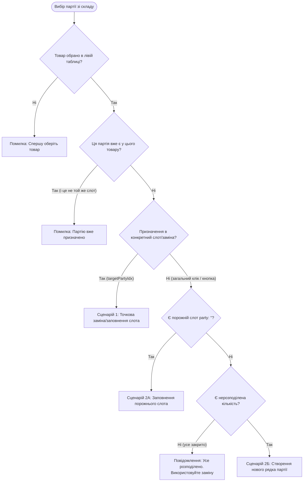

# Інструкція та Алгоритм Підбору Партій (Party Allocation Guide)

Даний документ детально описує поточну логіку та алгоритм підбору, призначення, заміни та валідації партій товару в модулі редагування доставки ([EditDeliveryModal.jsx](file:///d:/Projects/GOIT%20JS%20Course/Next/for_test/components/MapModule/components/EditDeliveryModal/EditDeliveryModal.jsx)).

---

## 1. Загальна концепція

У замовленні кожен товар має:
- **Планову кількість (`quantity`)**: загальний обсяг (вага/кількість), який потрібно доставити клієнту.
- **Список призначених партій (`parties`)**: масив конкретних серій товару зі складу, з яких комплектується замовлення:
  ```json
  [
    { "party": "Серія 2024-А", "party_quantity": 300 },
    { "party": "", "party_quantity": 200 }
  ]
  ```
  > Якщо назва партії порожня (`party: ""`), це означає **нераспределенный залишок (пулу дефіциту)**, який очікує призначення партії.

---

## 2. Способи підбору та призначення партій

Користувач може призначати партії 4 зручними способами:

| Спосіб | Дія користувача | Що відбувається |
|---|---|---|
| **1. Розумна кнопка «+ Взяти N»** | Клік по кнопці в таблиці залишків праворуч | Автоматично бере рівно стільки, скільки не вистачає товару (з урахуванням наявності на складі). |
| **2. Клік по рядку залишку** | Клік на будь-яке місце рядка партії в правій таблиці | Аналогічно кнопці «+ Взяти N». Якщо активна заміна — замінює вибрану партію. |
| **3. Drag & Drop (Перетягування)** | Затиснути партію за іконку перетягування `⠿` і потягнути вліво: | • **На рядок товару:** додає партію до товару.<br>• **На смугу комплектації (Strip):** заповнює вільний обсяг.<br>• **На конкретну партію:** точково замінює саме цей рядок. |
| **4. Точкова заміна (Кнопка 🔁)** | Натиснути кнопку «Замінити» у рядка партії в лівому вікні | Партія підсвічується пульсуючою рамкою, а кнопки в залишках стають янтарними `Замінити (N)`. Клік по будь-якому залишку замінює саме цю партію. |

---

## 3. Детальний алгоритм підбору (`applyPartyAllocation`)

Коли викликається призначення партії, виконується наступний ланцюжок перевірок і розрахунків:



---

### Сценарій 1: Точкова заміна / заповнення конкретного рядка
1. Визначається необхідна кількість для цього рядка (`targetSlotQty`).
2. Порівнюється з доступним бухгалтерським залишком на складі (`availStock`):
   - **Якщо на складі достатньо (`availStock >= targetSlotQty`):**
     - Рядок повністю заповнюється цією партією на всю необхідну кількість.
   - **Якщо на складі менше, ніж потрібно (`availStock < targetSlotQty`):**
     - У цей рядок записується весь доступний залишок зі складу (`qtyToTake = availStock`).
     - Різниця (`remainder = targetSlotQty - availStock`) **автоматично виноситься в новий рядок нижче з порожньою партією** (`party: ""`).
     - *Результат:* Баланс замовлення не порушується, користувач одразу бачить залишок дефіциту і може призначити на нього наступну партію.

---

### Сценарій 2: Додавання через загальну кнопку або клік по рядку
1. **Якщо вже є порожній слот (`party: ""`):**
   - Береться його обсяг `emptyQty`.
   - Якщо на складі менше, ніж `emptyQty` — призначається скільки є, а залишок розбивається на новий вільний слот.
   - Якщо на складі достатньо — слот повністю закривається.
2. **Якщо порожніх слотів немає:**
   - Рахується сума всіх уже призначених партій `currentPartiesSum`.
   - Рахується вільний нерозподілений обсяг: `unallocated = totalQty - currentPartiesSum`.
   - **Якщо `unallocated <= 0`:**
     - Видається повідомлення: *«Вся кількість уже розподілена по партіях. Перетягніть партію на конкретний рядок для заміни.»*
   - **Якщо `unallocated > 0`:**
     - Береться `min(unallocated, availStock)`.
     - Створюється новий рядок з партією.
     - Якщо залишився хвіст дефіциту — додається слот із залишком.

---

## 4. Логіка розумного розрахунку на кнопках (`getSmartTakeInfo`) та Живий Залишок

Система динамічно підраховує списання кожної партії за всіма заявками та товарами поточної доставки (`batchUsageMap`):

### А. Живий бухгалтерський залишок (Колонка «Бух.»)
- Якщо партія ще не використовувалась у доставці: виводиться стандартний залишок (наприклад, `500 кг`).
- Якщо частина партії вже призначена іншим заявкам/товарам:
  - Крупно відображається **реально доступний залишок**: `🟢 300 кг`.
  - Під ним підстрочник: `було 500`.
- Якщо партія повністю вичерпана замовленнями доставки:
  - Відображається `0` сірим кольором, підстрочник `було 500`.
- Якщо призначено більше, ніж є на складі:
  - Загорається червоний бейдж `🔴 Дефіцит: -N`.

### Б. Інспектор використання партії (Бейдж та поповер деталей)
- Поруч із назвою серії з'являється інтерактивний бейдж: `📦 У доставці: 200 кг`.
- При кліку на бейдж відкривається спливаюче вікно з деталізацією:
  - Список клієнтів та номерів заявок, куди пішла ця партія:
    - `• ТОВ «Агро-Світ» (#TE-00066973) — 150 кг`
    - `• ФГ «Нива» (#TE-00066980) — 50 кг`
  - Рядок підсумку: `Вільно для розподілу: 300 кг`.

### В. Розумна кнопка дії
1. **Режим заміни (`swapTarget` активний):**
   - Кнопка стає **янтарною**.
   - Текст: `Замінити (N)`, де $N = \min(\text{потреба слота}, \text{живий залишок})$.
   - Якщо партія вичерпана: `Вичерпано (0)`.
2. **Звичайний режим комплектації:**
   - Розраховує обсяг від **живого вільного залишку**, а не від старого складського числа.
   - Якщо потрібно 100 кг, а вільно 40 кг: кнопка запропонує `+ Взяти 40 кг` і не допустить випадкового перерозходу.
   - Якщо вільний залишок дорівнює 0: кнопка блокується зі статусом `Вичерпано`.
3. **Якщо потреби немає або товар не обрано:**
   - Нейтральна кнопка `+ Додати`.

---

## 5. Видалення партії (`handleDeleteParty`)

- При натисканні на хрестик `✕` навпроти партії:
  - Партія видаляється зі списку комплектації.
  - **Кількість не губиться!** Її обсяг автоматично повертається у вільний пул (`party: ""`), щоб загальна кількість позиції в замовленні залишалася коректною.

---

## 6. Валідація перед збереженням доставки

Перед збереженням модального вікна (кнопка «Готово»):
1. **Перевірка наявності партій:**
   - Якщо хоча б у одного товару партії не призначені або є нерозподілені залишки (`errorType === "unassigned"` / `no_parties`), з'являється модальне вікно-попередження зі списком таких товарів.
   - Диспетчер може або повернутися та допризначити партії, або підтвердити збереження, якщо це допустимо.
2. **Перевірка дефіциту:**
   - Система підсвічує червоним бейджем товари, де призначено більше, ніж реально доступно за бухгалтерією.
