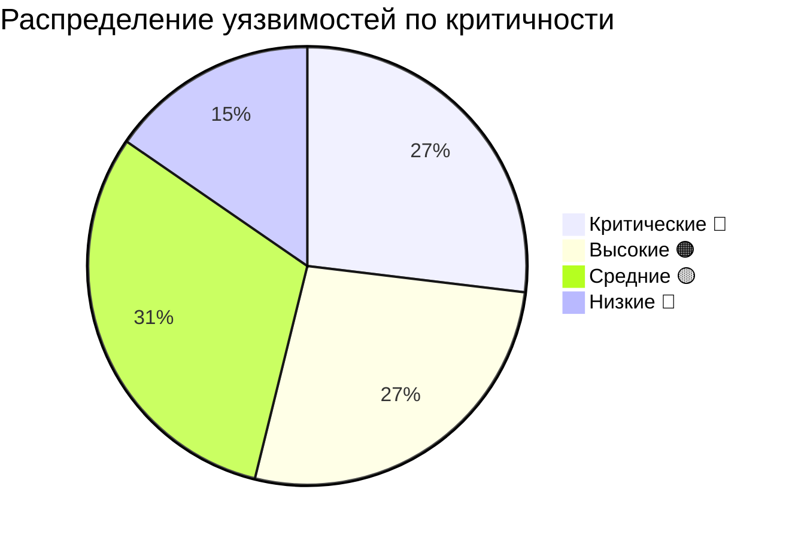

# 🔒 Комплексный аудит безопасности EridonAPI (Backend & Frontend)

**Дата:** 2026-06-22  
**Проект:** Eridon — Агро-платформа: FastAPI бэкенд (EridonAPI) и Next.js фронтенд (telegram_mini_app)  
**Технологии:** FastAPI, Next.js, Piccolo ORM, PostgreSQL, Telegram Mini App SDK, Zustand, Axios  

---

## Общая оценка: 🔴 КРИТИЧЕСКИЙ УРОВЕНЬ РИСКА

По результатам анализа бэкенда и фронтенда обнаружено **26 проблем безопасности**:
*   **7 критических** 🔴 (секреты в репозитории, обход auth в DEV_MODE, хардкод токенов)
*   **7 высоких** 🟠 (отсутствие auth на критических API-эндпоинтах, раскрытие исходного кода)
*   **8 средних** 🟡 (WebSocket без авторизации, куки без Secure флага, отсутствие rate limiting)
*   **4 низких** 🔵 (логирование токенов, hardcoded Telegram IDs)



---

## Раздел 1. Аудит безопасности Бэкенда (FastAPI) 🐍

### Критические проблемы 🔴

#### 1. Секреты закоммичены в репозиторий бэкенда
**Файлы:**
*   `.env` — содержит **реальные** пароли БД, токены ботов, API-ключи, SECRET_KEY.
*   `new_agri_bot_backend/credentials.json` — приватный ключ Google Service Account.
*   `new_agri_bot_backend/token.json` — OAuth токен Google Calendar.
*   `new_agri_bot_backend/credentials_task.json` — дополнительные учётные данные.

> [!CAUTION]
> Хотя файлы добавлены в `.gitignore`, если они были закомичены ранее, они навсегда остаются в истории git.
> **Утечка включает:** пароль PostgreSQL (`56LaWT7T`), Telegram Bot Tokens, SECRET_KEY для JWT, Nova Poshta API Key, Google Private Key.

**Исправление:** Ротировать ВСЕ секреты немедленно. Использовать `git filter-repo` для удаления файлов из истории коммитов.

#### 2. DEV_MODE полностью обходит аутентификацию
**Файл:** `new_agri_bot_backend/telegram_auth.py` (строки 100-122)
```python
dev_mode = os.getenv("DEV_MODE", "false").lower() == "true"
if dev_mode:
    return parsed  # Пропуск проверки подписи Telegram
```
**Проблема:** В `.env` на сервере/в репозитории `DEV_MODE` выставлен в `true`. Это позволяет любому пользователю отправлять поддельные заголовки и выполнять действия от имени любого аккаунта.

**Исправление:** Запретить `DEV_MODE` в продакшене. Сделать явное условие:
```python
if dev_mode and os.getenv("APP_ENV") != "production":
```

#### 3. SQL-инъекции через f-string в Raw SQL
**Файл:** `new_agri_bot_backend/data_retrieval.py` (строки 437-474)
```python
product_ids_str = ", ".join([f"'{p['id']}'" for p in products])
sql = f"""... WHERE pg.id IN ({product_ids_str}) ..."""
raw_results = await Remains.raw(sql)
```
**Проблема:** Конкатенация строк в SQL-запросах — классическая уязвимость.
**Исправление:** Использовать параметризованные запросы ORM Piccolo.

#### 4. WebSocket без авторизации
**Файл:** `new_agri_bot_backend/main.py` (строки 260-278)
**Проблема:** Любой анонимный клиент может подключиться к `/ws` и получать трансляции бизнес-событий (создание, изменение и удаление доставок с именами клиентов и телефонами).

#### 5. Незащищенный эндпоинт `/confirm-login-token`
**Файл:** `new_agri_bot_backend/telegram_auth.py` (строки 642-649)
**Проблема:** Подтверждение входа по 6-значному коду не имеет ограничений по количеству попыток (rate limiting). Злоумышленник может перебрать код (1 000 000 вариантов) за короткое время.

#### 6. Dockerfile копирует `.env` файл в образ
**Файл:** `Dockerfile` (строка 15)
```dockerfile
COPY .env /app/
```
**Проблема:** Секреты «запекаются» в Docker-образ, делая их доступными любому, кто имеет доступ к реестру образов или серверу.

---

### Высокие проблемы 🟠 (Бэкенд)

#### 7. Множество эндпоинтов без аутентификации
Многие эндпоинты бэкенда не содержат зависимостей проверки авторизации, что позволяет читать конфиденциальные данные без токена:
*   `POST /send_telegram_message/` и `/send_telegram_message_by_event` — позволяют отправлять сообщения любому Telegram ID.
*   `POST /upload-data` и `POST /upload_ordered_moved` — загрузка Excel-файлов без авторизации.
*   `GET /get_all_orders_and_address` и `GET /get_all_addresses` — список всех заказов, адресов клиентов и телефонов.
*   Все `GET /data/*` (события, задачи, доставки) — не проверяют авторизацию.

#### 8. Утечка внутренней структуры БД через ошибки
**Файлы:** `new_agri_bot_backend/main.py`, `new_agri_bot_backend/nova_poshta.py`
**Проблема:** При исключениях клиенту возвращаются стек-трейсы или сырые сообщения об ошибках БД (`return {"status": "error", "details": str(e)}`). Это раскрывает имена таблиц, логику связей и структуру системы.

#### 9. In-memory хранилище сессий без очистки (DoS-вектор)
**Файлы:** `main.py` (`sessions = {}`), `telegram_auth.py` (`login_tokens = {}`)
**Проблема:** Данные сессий не имеют TTL (времени жизни) и не очищаются, что может привести к переполнению оперативной памяти сервера (OutOfMemory) при DoS-атаке.

---

## Раздел 2. Аудит безопасности Фронтенда (Next.js) 🌐

### Критические проблемы 🔴

#### 1. Хардкод токена авторизации с сигнатурой в Header
**Файл:** `components/Header/Header.tsx` (строки 85-89)
```typescript
const isDev = process.env.NEXT_PUBLIC_DEV === "true";
if (isDev) {
  setInitData(
    "user=%7B%22id%22%3A548019148...&signature=mdGQ7UJyhhHY...&hash=b2e3a2aa20..."
  );
}
```
**Проблема:** В исходном коде компонента жестко прописана рабочая строка инициализации Telegram (`initData`) вместе с подписью (`signature` и `hash`). Несмотря на то, что это выполняется при `isDev`, при сборке приложения этот хардкод попадает в клиентские бандлы JavaScript. Злоумышленник может извлечь этот токен и получить доступ к API от имени данного пользователя.

**Исправление:** Перенести тестовые авторизационные данные в файл локального окружения `.env.local` (который игнорируется гитом) и считывать через `process.env.NEXT_PUBLIC_DEV_INIT_DATA`.

---

### Высокие проблемы 🟠 (Фронтенд)

#### 2. Раскрытие исходного кода в продакшене (Source Maps)
**Файл:** `next.config.ts` (строки 4-7)
```typescript
webpack: (config) => {
  config.devtool = 'source-map';
  return config;
}
```
**Проблема:** Конфигурация Next.js принудительно включает генерацию файлов `.map` (source-карт) для Webpack. Из-за этого любой пользователь через вкладку Sources в браузере может просмотреть оригинальный исходный код на TypeScript, комментарии разработчиков и архитектуру проекта.

**Исправление:** Генерировать source maps только в режиме разработки:
```typescript
webpack: (config, { dev }) => {
  if (dev) {
    config.devtool = 'eval-source-map';
  }
  return config;
}
```

#### 3. Отсутствие авторизационных заголовков в API-вызовах на фронтенде
**Файлы:** 
*   `lib/api.ts` — функции `getEvents`, `getEventById`, `getTaskById`, `getDeliveryByTask`, `getDeliveryByEvent`, `getRemainsForBi`, `getAddressByClient` и др. не принимают и не передают заголовок `X-Telegram-Init-Data`.
*   `app/admin/upload/page.tsx` — запросы к `/process/.../results` и `/upload-data` отправляются через стандартный экземпляр `axios` без передачи заголовка авторизации.

**Проблема:** Это вынуждает бэкенд оставлять данные эндпоинты открытыми для публичного доступа. Злоумышленник может получить адреса клиентов, номера телефонов и детали доставок без авторизации.

**Исправление:** Изменить сигнатуры функций в `lib/api.ts`, добавив обязательную передачу `initData` в заголовки всех запросов, и переписать вызовы на страницах.

---

### Средние проблемы 🟡 (Фронтенд)

#### 4. WebSocket-соединение без авторизационного токена
**Файл:** `hooks/useWebsocket.ts` (строка 21)
```typescript
const socket = new WebSocket(wsUri);
```
**Проблема:** При создании WebSocket-соединения не передается токен авторизации (например, в параметрах запроса `/ws?token=...`). Бэкенд не может проверить права доступа и шлет обновления доставок любому открытому соединению.

**Исправление:** Передать закодированный токен `initData` в query-параметрах при подключении:
```typescript
const socket = new WebSocket(`${wsUri}?token=${encodeURIComponent(initData)}`);
```

#### 5. Небезопасные атрибуты cookie при сохранении сессии
**Файл:** `lib/getInitData.ts` (строка 42)
```typescript
document.cookie = `tg_init_data=${encodeURIComponent(data)}; path=/; expires=${expires}; SameSite=Lax`;
```
**Проблема:** Cookie `tg_init_data` устанавливается без флага `Secure`. В сетях общего пользования (например, публичный Wi-Fi) трафик куки может быть перехвачен, если соединение по какой-то причине пойдет по протоколу HTTP вместо HTTPS.

**Исправление:** Добавить флаг `Secure;`:
```typescript
document.cookie = `tg_init_data=${encodeURIComponent(data)}; path=/; expires=${expires}; SameSite=Lax; Secure`;
```

---

## Сводный план приоритетов исправления (Бэкенд + Фронтенд)

| Приоритет | Компонент | Описание проблемы | Сложность фикса |
| :--- | :--- | :--- | :--- |
| 🚨 **НЕМЕДЛЕННО** | Бэкенд | Секреты (пароли, ключи) закоммичены в git-репозиторий | 🟢 Легко (ротация ключей) |
| 🚨 **НЕМЕДЛЕННО** | Бэкенд | `DEV_MODE` bypass (обход авторизации) | 🟢 Легко |
| 🚨 **НЕМЕДЛЕННО** | Фронтенд | Хардкод авторизационного токена в `Header.tsx` | 🟢 Легко |
| 🚨 **НЕМЕДЛЕННО** | Бэкенд | `.env` копируется в Dockerfile | 🟢 Легко |
| 📅 **1 день** | Фронтенд | Отсутствие source-маппинга в продакшене (Source Maps leak) | 🟢 Легко |
| 📅 **2 дня** | Бэкенд + Фронт | WebSocket без авторизации | 🟡 Средне |
| 📅 **3 дня** | Бэкенд + Фронт | Добавление авторизации во все эндпоинты `GET /data/*` и загрузки | 🟡 Средне (требует правок в ~15 эндпоинтах) |
| 📅 **3 дня** | Бэкенд | Защита эндпоинта `/confirm-login-token` (Rate Limiting) | 🟡 Средне |
| 📅 **1 неделя** | Бэкенд | SQL-инъекции в `data_retrieval.py` | 🟢 Легко |
| 📅 **1 неделя** | Фронтенд | Куки сессии без флага `Secure` | 🟢 Легко |

---

## Рекомендации по исправлению для нового проекта

1. **Единый Axios клиент**: Настроить на фронтенде перехватчик (Axios Interceptor), который автоматически прикрепляет заголовок `X-Telegram-Init-Data` к каждому исходящему запросу к нашему API, если токен присутствует в Zustand-сторе. Это избавит от необходимости вручную передавать `initData` во все функции API.
2. **Селективная генерация Source Maps**: В `next.config.ts` отключить `source-map` для продакшен-сборок.
3. **Безопасный WebSocket**: На бэкенде проверять query-параметр `token` перед подтверждением WebSocket-соединения.
